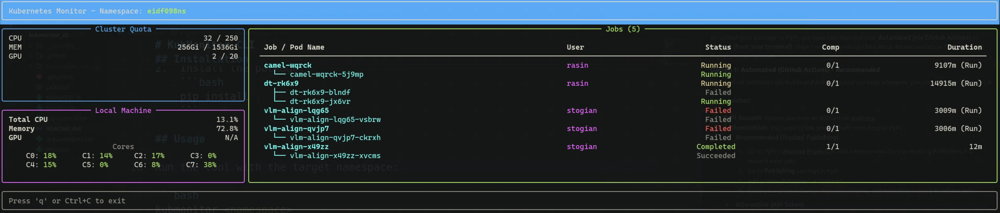

<div align="center">


# KubMonitor CLI

**A beautiful, nvitop-style Kubernetes monitor for your terminal.**

[](https://pypi.org/project/kubmonitor-cli/)
[](https://pypi.org/project/kubmonitor-cli/)
[](LICENSE)
[](https://github.com/vios-s/kubmonitor_cli/actions)

</div>

---

## ✨ Overview

**KubMonitor** provides a real-time, high-fidelity dashboard for your Kubernetes clusters directly in your terminal. Inspired by tools like `nvitop` and `btop`, it combines cluster quotas with local machine metrics in a slick, responsive TUI (Terminal User Interface).



## 🚀 Features

- **📊 Real-time Dashboard**: Live updates of CPU, Memory, and GPU usage.
- **⚡ Advanced GPU Monitoring**: Auto-detects NVIDIA GPU models (H100, A100, V100, etc.) and visualizes detailed usage quotas.
- **📜 Live Log Viewer**: Integrated pod log viewer with auto-refresh capability.
- **☸️ Namespace Scoped**: Monitor specific Kubernetes namespaces with ease.
- **💻 Hybrid Metrics**: View both K8s Cluster Quotas and Local Machine stats side-by-side.
- **✨ Reactive TUI**: Built with `Refreshed` layouts using [Rich](https://github.com/Textualize/rich).
- **🎨 Monokai Colors**: A Monokai-inspired truecolor scheme by default (`--theme classic` or `KUBMONITOR_THEME=classic` for plain terminal colors).
- **📒 Usage Accounting**: Optional history of GPU-hours per person and per
  research project, with label validation before you deploy.
- **🖥️ Cross-Platform**: Works seamlessly on Linux, macOS, and Windows.

## 📦 Installation

Install via pip:

```bash
pip install kubmonitor-cli
```

Or install from source:

```bash
git clone https://github.com/vios-s/kubmonitor_cli.git
cd kubmonitor_cli
pip install .
```

## 🎮 Usage

### Getting Help

View all available options and usage information:

```bash
kubmonitor --help
# or
kubmonitor -h
```

Check the version:

```bash
kubmonitor --version
# or
kubmonitor -v      # -V works too
```

### Monitor a Namespace

Simply run the command followed by the target namespace:

```bash
kubmonitor <namespace>
```

**Example:**

```bash
kubmonitor eidf098ns
```

If no namespace is specified, it defaults to `default`:

```bash
kubmonitor
```

### Mock Mode (Testing/Debug)

For testing or debugging purposes without requiring access to a Kubernetes cluster, you can use the `--mock` flag to run KubMonitor with simulated data:

```bash
kubmonitor --mock
```

**Note:** When using `--mock`, you cannot specify a namespace. Mock mode uses generated test data and doesn't connect to a real cluster.

This will generate realistic mock data including:
- Simulated HPC Cluster with H100/A100 GPU nodes.
- Simulated resource quotas (CPU, Memory, GPU).
- Mock Kubernetes jobs with various states (running, completed, failed).
- Live simulated logs for debugging the viewer.
- Mock pods with realistic resource usage patterns
- Generated timestamps and durations

### Keyboard Shortcuts

| Key | Description |
| :---: | :--- |
| `↑` / `↓` | **Navigate** up and down |
| `Enter` | **View logs** for the selected pod |
| `d` | **Describe** the selected job/pod (`kubectl describe`) |
| `u` | **Per-user view**: live GPU allocation leaderboard |
| `q` | **Quit** the application |
| `Ctrl+C` | Force Exit |

## 📒 Usage Accounting

Beyond the live dashboard, KubMonitor can keep a **history** of who ran what,
so a shared namespace can answer "where did the GPU-hours go this month?".
Three subcommands, all independent of the TUI:

| Command | What it does |
| :--- | :--- |
| `kubmonitor collect` | Snapshot current workloads into a SQLite database. Run it on a schedule (cron). |
| `kubmonitor report` | Summarise that history per person and per project. |
| `kubmonitor validate` | Check job YAML carries the required ownership labels — *before* you deploy it. |

### Ownership labels

Accounting works by reading three labels off each workload, on the Job **and**
its pod template:

```yaml
labels:
  owner: ada_lovelace     # the account that runs it
  project: mri_recon      # the RESEARCH project — the strand of work
  purpose: batch          # batch | interactive | serving
```

`project` is the user's **research project**, not the cluster allocation or
group code. A group code would be identical on every workload in the namespace
and tell a report nothing. Reports group by this value *verbatim*, so
`mri_recon` and `mri-recon` count as two different projects.

See **[docs/LABELS.md](docs/LABELS.md)** for the full contract, including the
optional label prefix and what happens to workloads collected before a label
existed.

### Configuration

Most invocations read a project config. `--config` wins; otherwise
`$KUBMONITOR_CONFIG`, then `~/.config/kubmonitor/project.yaml`:

```yaml
project: eidf105                       # allocation scope key for the DB
namespace: eidf105ns                   # namespace to collect from
db: /path/to/usage.sqlite              # where history accumulates
members_file: /path/to/members.yaml    # optional: accounts -> people
label_prefix: ""                       # optional: prefix on the three labels

# Optional. The group's known research projects — advisory only.
research_projects:
  - mri_recon
  - fairness
  - diffusion_priors
```

A full annotated example lives in
[`examples/project.yaml`](examples/project.yaml). Keep your real copy (and
`members.yaml`, and the database) **outside** any public repo — `members.yaml`
contains personal data.

### Catching spelling drift

With `research_projects` set, `validate` flags a name that looks like a
misspelling of a registered one — the failure mode that quietly splits one
project across two rows in every report:

```console
$ kubmonitor validate --config project.yaml job.yaml
warning: job.yaml: Job project 'mri-recon' is not registered, but 'mri_recon'
         is — same name, different spelling? Reports count them separately
OK: 1 workload document(s) carry the required ownership labels
```

This is **advisory** and never fails the command, so nobody has to land a
config change before submitting a job. `validate` also works with no config at
all — you simply lose the spelling hint.

## 🛠️ Technology Stack

- **[Rich](https://github.com/Textualize/rich)**: For beautiful terminal formatting and layout.
- **[Psutil](https://github.com/giampaolo/psutil)**: For retrieving local system metrics.
- **Kubectl**: Under the hood, it uses your local `kubectl` configuration to fetch cluster data.

## 📄 License

This project is licensed under the MIT License - see the [LICENSE](LICENSE) file for details.

---

<div align="center">
  <sub>Made with ❤️ by yyx</sub>
</div>
